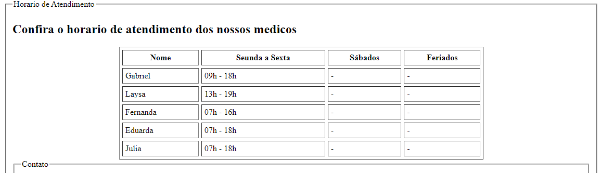

# Trilha HTML - Dio.me
## Módulo 02 - HTML I - Conceitos Básicos

Este desafio tem como objetivo, criar um site "quase" completo, com tudo o que foi visto no módulo 2, o foco é sobre o uso das tags e estrutura, o css usado foi somente para ajudar no minimo necessario para estruturação.  Os temas que foram abordados são:
- Formulários
- Estruturação e formatação de texto
- Iframe
- Links
- Uso de imgans
- Tabelas
[alt text](image.png)

